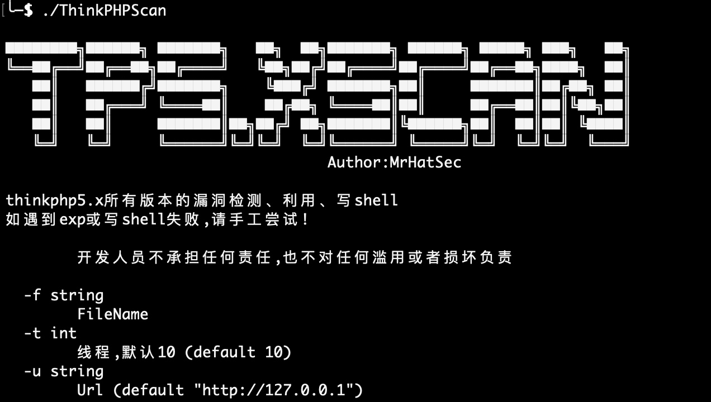
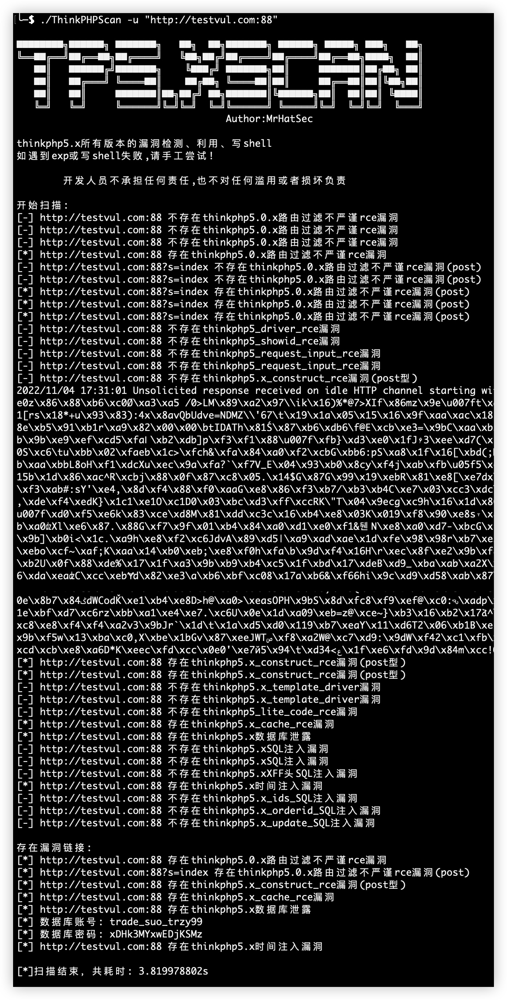
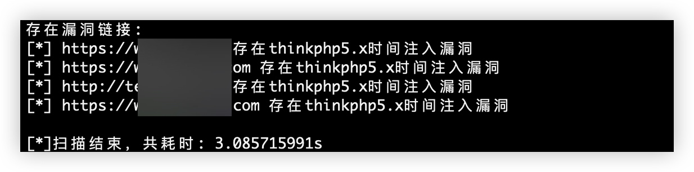

<h1 align="center">ThinkPhp 漏洞检测工具</h1>


**Python版本** https://github.com/iceberg-N/thinkphp5.x_Scan

## 简介

一款ThinkPhp5.x版本漏洞探测工具，如下是次工具支持的扫描的全部POC

## 支持POC列表

```
check_5_x_route_rce
check_5_0_x_db
check_5_x_construct_rce 
check_5_x_construct_other
check_5_x_sql
check_5_x_xff_sql 
check_5_x_time_sql  
check_5_x_driver_rce  
check_5_x_showid_rce
check_5_x_request_input_rce 
check_5_x_template_driver_rce  
check_5_x_cache_rce  
check_5_x_ids_sql
check_5_x_orderid_sql  
check_5_x_update_sql
```
## 使用说明

单Url扫描

```
./ThinkPhpScan -u "http://127.0.0.1"
```

批量扫描
```
./ThinkPhpScan -f urls.txt
```

线程大小(默认线程10)
```
./ThinkPhpScan -f urls.txt -t 100
```

完整参数
```
 -f string
        FileName
  -t int
        线程,默认10 (default 10)
  -u string
        Url (default "http://127.0.0.1")
```

## 运行截图



单Url扫描：


批量扫描：


## Team


## 免责声明

在使用本工具进行检测时，您应确保该行为符合当地的法律法规，并且已经取得了足够的授权。请勿对非授权目标进行扫描。

如您在使用本工具的过程中存在任何非法行为，您需自行承担相应后果，我们将不承担任何法律及连带责任。

